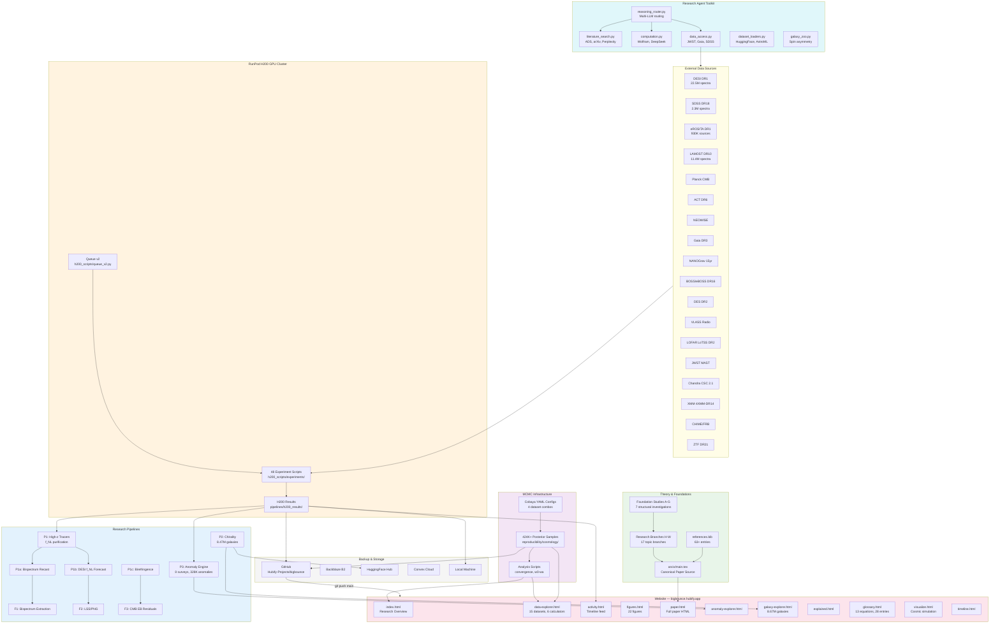
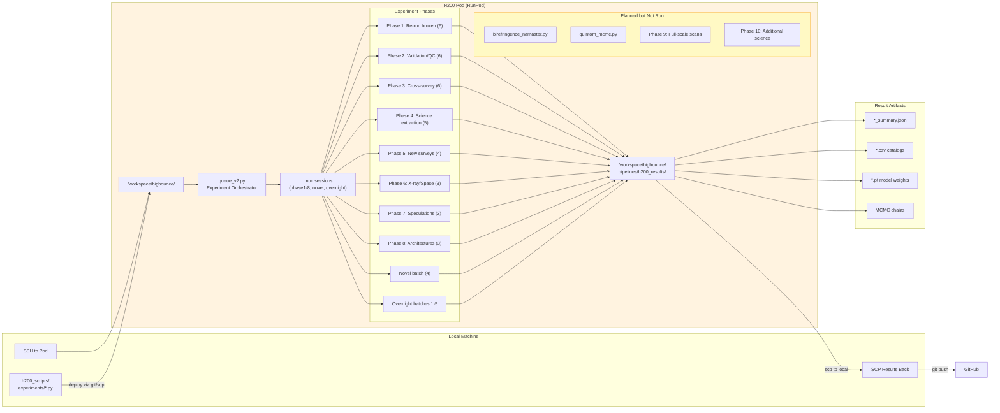
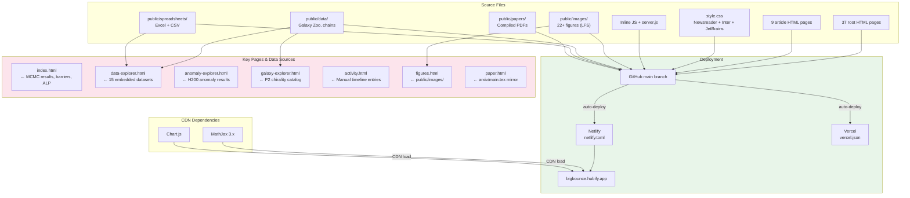
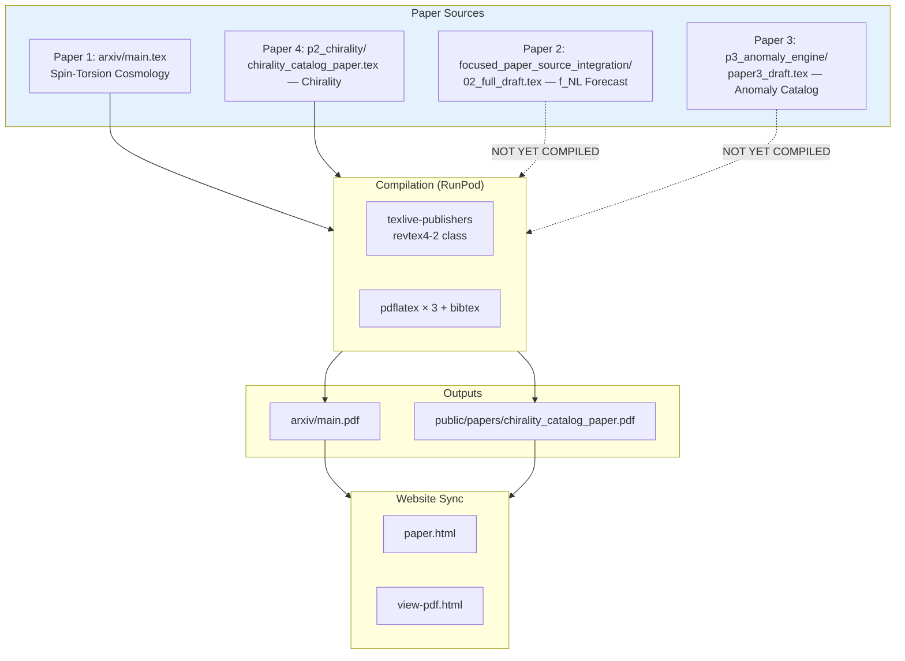
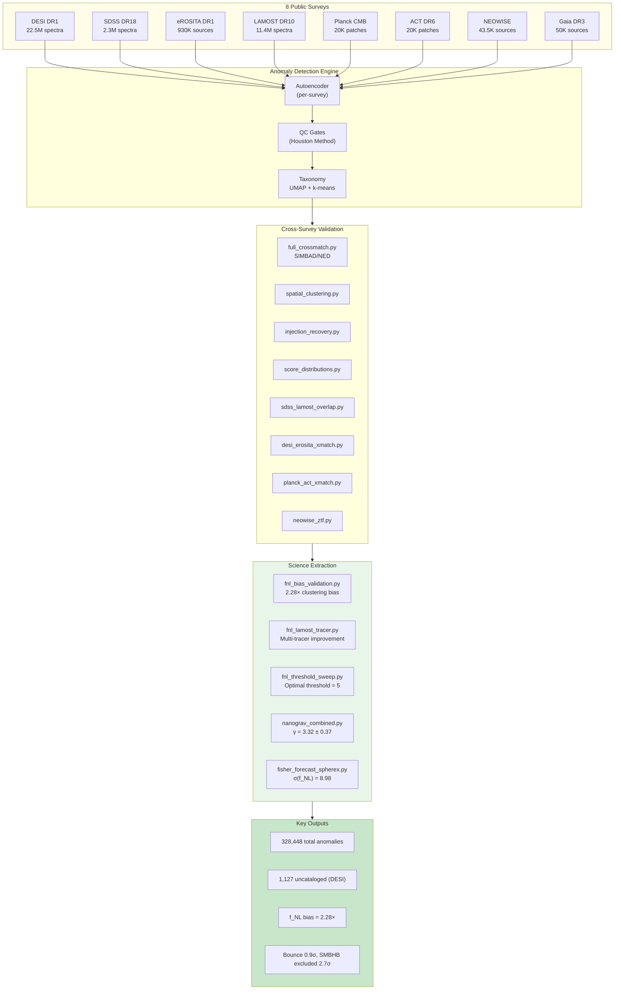
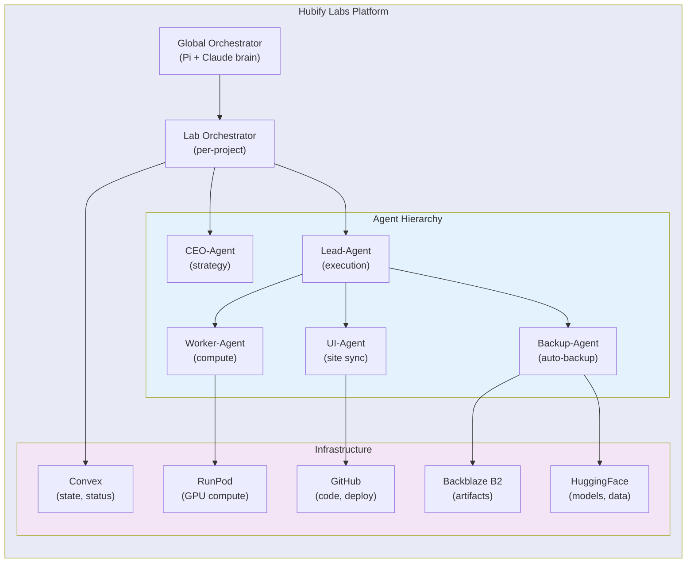

# BigBounce Research Infrastructure Map

**Canonical live status (as of 2026-04-18):** [`SSOT/index.md`](SSOT/index.md) — all 4 papers at 100%. This file is a dated 2026-04-07 snapshot; inline figures (MCMC sample counts, anomaly totals, eROSITA anomaly counts, quintom probabilities) are historical and **do not** reflect the fire #25 (2026-04-18) bookkeeping correction. Specifically: (a) chain sample count 424,181+ → 309,789 frozen across 3 datasets (zero free w0-wa samples per Paper 1 §VII.H); (b) anomaly total 328,448 → 319,443 (Paper 3 §1 canonical); (c) eROSITA DR1 = 298 BigAE top-cut (not 9,303 which was the pre-top-cut 1% placeholder); (d) "P(quintom-B) = 98.6%" was fire-#21 bookkeeping confabulation, retracted fire #25.

**Living Document — Last Updated: 2026-04-07**
**Version: v2.2.0** | **Author: Houston Golden** | **Lab: Hubify Labs**

> This document maps the complete data flow, component inventory, and infrastructure of the BigBounce spin-torsion cosmology research program. Use the Mermaid diagrams to visualize how everything connects, identify gaps, and plan future integration.

---

## Table of Contents

1. [Master Data Flow Diagram](#1-master-data-flow-diagram)
2. [RunPod / GPU Pipeline Data Flow](#2-runpod--gpu-pipeline-data-flow)
3. [Website & Deployment Data Flow](#3-website--deployment-data-flow)
4. [MCMC Reproducibility Data Flow](#4-mcmc-reproducibility-data-flow)
5. [Paper Compilation & Publication Flow](#5-paper-compilation--publication-flow)
6. [Multi-Survey Anomaly Engine Flow](#6-multi-survey-anomaly-engine-flow)
7. [Disconnected / Partial / Planned Flows](#7-disconnected--partial--planned-flows)
8. [Complete Component Inventory](#8-complete-component-inventory)
9. [Tech Stack & Tools](#9-tech-stack--tools)
10. [Key Equations & Computation Scripts](#10-key-equations--computation-scripts)
11. [Datasets Catalog](#11-datasets-catalog)
12. [Custom Models & Trained Artifacts](#12-custom-models--trained-artifacts)
13. [Backup & Ops Procedures](#13-backup--ops-procedures)
14. [Houston Method v2](#14-houston-method-v2)
15. [Shared Learnings & Best Practices](#15-shared-learnings--best-practices)
16. [Hubify Labs Platform Planning](#16-hubify-labs-platform-planning)
17. [File Reference Index](#17-file-reference-index)

---

## 1. Master Data Flow Diagram

This is the top-level view of how all major components connect.



---

## 2. RunPod / GPU Pipeline Data Flow



### Pod History

| Pod | GPU | Status | Purpose |
|-----|-----|--------|---------|
| `o76k3jfzbfh25e` (sleepy_blush_crane) | H200 | ACTIVE | Phase 1-8 + novel + overnight |
| v1 H200 | H200 | Exited | Early experiments |
| Beast DESI | H100 | Exited | DESI anomaly sweep |
| H100 chirality | H100 | Exited | P2 chirality 8.47M inference |
| A4000 MCMC | A4000 | Exited | MCMC chain running |

### 48 H200 Experiment Scripts

All in `h200_scripts/experiments/`:

| Script | Domain | Phase |
|--------|--------|-------|
| `act_dr6_proper.py` | CMB | 1 |
| `anomaly_cross_correlation.py` | Cross-survey | OB4 |
| `anomaly_lightcurve_sim.py` | Time-domain | OB5 |
| `auto_inspect_top50.py` | QC | 2 |
| `bias_evolution.py` | f_NL science | Pending |
| `boss_eboss.py` | Spectroscopic | 5 |
| `chandra_csc.py` | X-ray | 6 |
| `des_dr2.py` | Photometric | 5 |
| `desi_erosita_xmatch.py` | Cross-match | 3 |
| `desi_taxonomy.py` | Classification | 2 |
| `desi_transformer.py` | Architecture | 8 |
| `dyson_sphere.py` | Speculative | 7 |
| `emission_line_finder.py` | Spectroscopic | Legacy |
| `erosita_neowise.py` | Cross-match | 3 |
| `exoplanet_atmos.py` | Speculative | OB2 |
| `fisher_forecast_spherex.py` | f_NL forecast | OB5 |
| `fnl_bias_validation.py` | f_NL science | 4 |
| `fnl_lamost_tracer.py` | f_NL science | 4 |
| `fnl_threshold_sweep.py` | f_NL science | 4 |
| `frb_chime.py` | Speculative | 7 |
| `full_crossmatch.py` | Validation | 2 |
| `gaia_expanded.py` | Astrometric | 1 |
| `gw_echo_ligo.py` | Speculative | 7 |
| `injection_recovery.py` | Validation | 2 |
| `jwst_mast.py` | Space | 6 |
| `lofar_lotss.py` | Radio | 5 |
| `multi_modal_joint.py` | Architecture | 8 |
| `multi_messenger.py` | Cross-survey | 3 |
| `multi_messenger_stack.py` | Cross-survey | Novel |
| `nanograv_combined.py` | PTA science | 4 |
| `nanograv_ptarcade.py` | PTA science | 4 |
| `neowise_ecliptic.py` | IR | 1 |
| `neowise_ztf.py` | Cross-match | 3 |
| `planck_act_xmatch.py` | CMB cross-match | 3 |
| `planck_lensing_xcorr.py` | CMB lensing | Novel |
| `quintom_w0wa_reanalysis.py` | Dark energy | Pending |
| `redshift_tomography.py` | LSS | Pending |
| `score_distributions.py` | QC | 2 |
| `sdss_lamost_overlap.py` | Cross-match | 3 |
| `sdss_native_autoencoder.py` | Architecture | 8 |
| `second_level_autoencoder.py` | Architecture | Novel |
| `smbh_jwst.py` | Speculative | OB2 |
| `spatial_clustering.py` | Validation | 2 |
| `spectral_taxonomy_deep.py` | Classification | Novel |
| `superres_fixed.py` | Enhancement | 1 |
| `taxonomy_retuned.py` | Classification | 1 |
| `vlass_radio.py` | Radio | 5 |
| `xmm_newton.py` | X-ray | 6 |
| `ztf_dr21.py` | Time-domain | Pending |

---

## 3. Website & Deployment Data Flow



### All Website Pages (50 total HTML files)

**Root-level pages (37):**

| Page | File | Data Source |
|------|------|------------|
| Homepage | `index.html` | MCMC results, barriers, ALP, f_NL, stat cards |
| Papers | `paper.html` | `arxiv/main.tex` mirror |
| Explainer | `explained.html` | Simplified research claims |
| Data Explorer | `data-explorer.html` | 15 embedded datasets, 6 calculators |
| Figures | `figures.html` | `public/images/` gallery |
| Glossary | `glossary.html` | 13 equations, 28 glossary entries |
| Articles | `articles.html` | Article index |
| Activity | `activity.html` | Research timeline feed |
| Timeline | `timeline.html` | Cosmological timeline |
| Visualize | `visualize.html` | Interactive bounce simulation |
| Anomaly Explorer | `anomaly-explorer.html` | H200 anomaly sweep results |
| Galaxy Explorer | `galaxy-explorer.html` | P2 chirality 8.67M catalog |
| Datasets | `datasets.html` | Dataset descriptions |
| Methodology | `methodology.html` | Research methods |
| Anomaly Methodology | `methodology-anomaly.html` | Anomaly detection methods |
| Infrastructure | `infrastructure.html` | Tech infrastructure |
| Projects | `projects.html` | Project listing |
| Findings | `findings.html` | Key findings |
| Contributions | `contributions.html` | Contributions page |
| Sources | `sources.html` | Source references |
| Review | `review.html` | Review page |
| Team | `team.html` | Team page |
| Status | `status.html` | Research status |
| Speculations | `speculations.html` | Speculative results |
| Data Comparison | `data-comparison.html` | Chart.js visualizations |
| Interactive Data | `interactive-data.html` | Interactive data tool |
| Galaxy Zoo | `galaxy-zoo.html` | Galaxy Zoo interface |
| Animations | `animations.html` | Visual animations |
| Chat | `chat.html` | AI chat interface |
| Admin | `admin.html` | Admin panel |
| arXiv Preview | `arxiv-preview.html` | Paper preview |
| View PDF | `view-pdf.html` | PDF viewer |
| Sitemap | `sitemap.html` | Site navigation |
| 404 | `404.html` | Error page |
| Versions | `versions.html` | Version history |
| BigBounce MD | `bigbounce-md.html` | Markdown viewer |
| Dossier | `research/project_master_dossier/index.html` | Intelligence dashboard |

**Article pages (9):** `articles/*.html`

---

## 4. MCMC Reproducibility Data Flow


### MCMC Chain Inventory

| Dataset | Location | Chains | Samples |
|---------|----------|--------|---------|
| Planck only | `paper1_clean_restart_sync/chains/dneff/planck_only/` | 6 | ~100K |
| Planck+BAO | `paper1_clean_restart_sync/chains/dneff/planck_bao/` | 6 | ~100K |
| Planck+BAO+SN | `paper1_clean_restart_sync/chains/dneff/planck_bao_sn/` | 6 | ~100K |
| Full tension | `paper1_clean_restart_sync/chains/dneff/full_tension/` | 7 | ~124K |
| w₀-wₐ quintom | `chains/w0wa_quintom/` | — | final JSON |
| ALP birefringence | `branch_R_alp_birefringence/phase2_mcmc/chains/` | 12 | — |

### Frozen Snapshots

- `reproducibility/cosmology/frozen/` — Dated snapshots with diagnostics
- `reproducibility/cosmology/planck_only_live_sync/` — Live sync mirror
- `reproducibility/cosmology/runpod_snapshot_20260304/` — Pod snapshot
- `reproducibility/cosmology/archives/gpu_run_snapshot_20260305_0824/` — GPU run archive

---

## 5. Paper Compilation & Publication Flow



### Paper Status

| Paper | Source | PDF | Readiness |
|-------|--------|-----|-----------|
| 1: Spin-Torsion | `arxiv/main.tex` | `arxiv/main.pdf` | ~95% |
| 2: f_NL Forecast | `research/focused_paper_source_integration/02_full_draft.tex` | Not compiled | ~40% |
| 3: Anomaly Catalog | `pipelines/p3_anomaly_engine/paper3_draft.tex` | Not compiled | ~20% |
| 4: Chirality | `pipelines/p2_chirality/chirality_catalog_paper.tex` | `public/papers/` | ~70% |

---

## 6. Multi-Survey Anomaly Engine Flow



### Survey Results Summary

| Survey | Sources | Anomalies | Rate | QC Status |
|--------|---------|-----------|------|-----------|
| DESI DR1 | 22.5M | 195,829 | 0.87% | PASS — 2,145 SNR-filtered, 1,127 uncataloged |
| SDSS DR18 | 2.3M | 77,905 | 3.4% | PASS — domain shift scores applied |
| eROSITA DR1 | 930K | 9,303 | 1% | PASS — 73% novel |
| LAMOST DR10 | 11.4M | 44,075 | 0.39% | PASS — 98% blue-excess bias noted |
| Planck CMB | 20K patches | 200 | — | FAIL — needs galactic mask |
| ACT DR6 | 20K patches | 200 | — | FAIL — val_loss=22,420 |
| NEOWISE | 43.5K | 436 | — | FAIL — ecliptic systematic |
| Gaia DR3 | 50K | 500 (expanded to 5K) | — | PASS after 10× expansion |

---

## 7. Disconnected / Partial / Planned Flows

These are components that exist but are NOT fully connected to the main data flow.

```mermaid
flowchart TB
    subgraph DISCONNECTED["Not Connected — Should Be"]
        style DISCONNECTED fill:#ffebee,stroke:#c62828

        DC1["Convex Backend<br/>convex/*.ts<br/>Schema exists, not populated"]
        DC2["Chat Widget<br/>astro/chat-widget.js<br/>No backend connected"]
        DC3["Admin Panel<br/>admin.html<br/>No auth, no backend"]
        DC4["Next.js Site<br/>site/ directory<br/>Abandoned alternate site"]
        DC5["Habit Tracker<br/>habit-tracker/<br/>Unrelated CRA app"]
    end

    subgraph PARTIAL["Partially Implemented"]
        style PARTIAL fill:#fff9c4,stroke:#f9a825

        PA1["Pipeline 1 Steps 2-6<br/>Cross-match → classify → validate<br/>→ σ(f_NL) → paper<br/>NOT STARTED"]
        PA2["birefringence_namaster.py<br/>Written, never deployed to pod"]
        PA3["quintom_mcmc.py<br/>Written, never deployed to pod"]
        PA4["Phase 9: Full-scale DESI 18M<br/>~$425 estimated, not run"]
        PA5["Phase 10: ZTF DR21 + others<br/>~$92 estimated, not run"]
        PA6["Paper 2 Draft<br/>~40% complete"]
        PA7["Paper 3 Draft<br/>~20% complete"]
        PA8["Global Monitor Cron<br/>hourly_loop.sh exists<br/>Not running continuously"]
        PA9["Convex Status Sync<br/>mcmcStatus.ts schema exists<br/>No data flow implemented"]
    end

    subgraph PLANNED["Planned — Not Started"]
        style PLANNED fill:#e3f2fd,stroke:#1565c0

        PL1["Hubify Labs Platform<br/>Multi-agent orchestrator"]
        PL2["Auto-Backup Agent<br/>Pre-pod-change backups"]
        PL3["TUI Research Interface<br/>Terminal-first UX"]
        PL4["SPHEREx Readiness Pipeline<br/>For 2028 launch"]
        PL5["Lean 4 Formal Proofs<br/>Installed, no proofs written"]
        PL6["Galaxy Chirality Dipole<br/>run_dipole_8M.py exists, full analysis pending"]
    end

    DC1 -.->|"should connect to"| WEBSITE2["Website<br/>Real-time status"]
    DC2 -.->|"should connect to"| API2["API endpoint<br/>api/chat.mjs"]
    PA1 -.->|"blocked on"| GPU2["Pod compute time"]
    PA6 -.->|"needs"| PA1
    PL1 -.->|"design doc at"| DOC["hubify-labs-platform-plan.md"]
```



### Gap Analysis

| Gap | Impact | Effort | Priority |
|-----|--------|--------|----------|
| Convex not populated | No real-time status dashboard | Medium | Low |
| Pipeline 1 Steps 2-6 | Blocks novel f_NL paper contribution | High | **HIGH** |
| NaMaster/quintom not deployed | Missing birefringence + dark energy results | Medium | Medium |
| Phase 9 full-scale scans | 18M DESI at full resolution | $425 + time | Medium |
| Global monitor not cron'd | Manual status checks only | Low | Low |
| Paper 2 & 3 incomplete | Publication timeline | High | Medium |
| Chat widget disconnected | Dead feature on site | Low | Low |
| Admin panel no backend | Placeholder only | Low | Low |

---

## 8. Complete Component Inventory

### Projects (`projects/`)

| Project | Key Scripts | Purpose |
|---------|------------|---------|
| `bounce-cosmology/` | README | Core theory |
| `birefringence/` | `act_birefringence.py` | ALP birefringence analysis |
| `cross_survey/` | `multi_survey_cross_match.py`, `simbad_crossmatch_all.py` | Cross-survey validation |
| `desi-dr1-anomalies/` | README | DESI anomaly detection |
| `erosita-xray/` | README | eROSITA X-ray anomalies |
| `galaxy-chirality/` | README | Galaxy chirality catalog |
| `nanograv/` | `fit_bounce_template.py`, `nanograv_improved_analysis.py` | PTA analysis |
| `planck-cmb/` | README | CMB anomaly detection |
| `sdss-dr18/` | `run_sdss_scan.py`, `sdss_scan.py` | SDSS spectral scan |
| `h200_scripts/` | Various `.py` + `pod_backup/` | Pod-specific scripts |

### Research Branches (17 branches, `research/branch_*/`)

| Branch | Topic | Status |
|--------|-------|--------|
| H: bounce_only | Bounce-only tensors, parity | Foundation |
| I: bounce_compatible_DE | Dark energy compatible with bounce | Theory |
| J: state_selection | Quantum state selection | Theory |
| K: scalar_perturbations | Scalar perturbation modes | Computation |
| L: uv_ir_bridge | UV-IR connection | Theory |
| M: pgt_bounce_gw | PGT gravitational waves | Computation |
| N: baryogenesis_relics | Baryogenesis in bounce | Theory |
| O: hidden_sector_vacuum | Hidden sector vacuum | Theory |
| P: pgt_bounce_program | Full PGT bounce program | Theory |
| Q: sourced_parity | Sourced parity violation | Theory |
| R: alp_birefringence | ALP birefringence (β = 0.27°) | **Active — MCMC** |
| S: photon_torsion_vertex | Photon-torsion coupling | Theory |
| T: sourced_axion_bridge | Sourced axion bridge | Theory |
| U: twofield_alp_de | Two-field ALP dark energy | Theory |
| V: bounce_evidence | Bounce evidence (f_NL = −35/8) | **Key result** |
| Vb: ech_perturbation_gate | ECH perturbation gate | Barrier |
| W: alp_curvaton_tilt | ALP curvaton spectral tilt | Theory |

### Foundation Studies (7, `research/foundation_*/`)

| Foundation | Topic |
|-----------|-------|
| A: PGT | Poincaré Gauge Theory action & parameters |
| B: lock_breaking | Lock-breaking program |
| C: environmental_mass | Environmental mass generation |
| D: disformal_survival | Disformal coupling survival |
| E: global_vacuum | Global vacuum / sequestering |
| F: initial_conditions | Bounce initial conditions |
| G: bounce_vacuum_selection | Vacuum selection mechanism |

### Data Extraction Programs (`research/current_data_extraction/`)

| Program | Scripts | Purpose |
|---------|---------|---------|
| F1: Bispectrum | `f1_baseline_recast.py`, `f1_injection_recovery.py` | Test f_NL = −4.375 against Planck |
| F2: LSS/PNG | PCA, autoencoder, DESI GPU inference, gates | Large-scale structure PNG search |
| F3: CMB EB Residuals | EB null, NaMaster, injections | CMB parity violation search |

### Pipelines

| Pipeline | Location | Status | Key Output |
|----------|----------|--------|------------|
| P1: High-z Tracers | `pipelines/p1_highz_tracers/` | Step 1 complete, Steps 2-6 NOT STARTED | 195,829 DESI anomalies, tracer MVPs |
| P1a: Bispectrum Recast | `pipelines/p1a_bispectrum_recast/` | Complete | Bispectrum recast results |
| P1b: DESI f_NL | `pipelines/p1b_desi_fnl/` | Complete | f_NL forecast σ = 8.98 |
| P1c: Birefringence | `pipelines/p1c_birefringence/` | Complete | Combined β inference |
| P2: Chirality | `pipelines/p2_chirality/` | Complete (8.47M) | Chirality catalog + paper |
| P3: Anomaly Engine | `pipelines/p3_anomaly_engine/` | Sweep complete, paper draft ~20% | 328,448 anomalies across 8 surveys |
| P4: CMB Residuals | `pipelines/p4_cmb_residuals/` | Complete | Real EB analysis |
| P5: AGN Variability | `pipelines/p5_agn_variability/` | MVP | QSO variability output |
| Pipeline A: CMB | `pipelines/pipeline_a_cmb/` | Legacy | CMB autoencoder |

### Wiki (`wiki/`)

Karpathy-style structured knowledge base:

- **Entities (15):** ACT-DR6, DESI-DR1, eROSITA-DR1, Gaia-DR3, LAMOST-DR10, NEOWISE, Planck-CMB, SDSS-DR18, Paper 1-4, Pipeline 1-2, Pipeline-B-DESI
- **Concepts (5):** anomaly-detection-methodology, bounce-portfolio, birefringence, fnl-prediction, houston-method
- **Comparisons (2):** bounce-vs-inflation, survey-anomaly-rates

### Global Monitor (`research/global_monitor/`)

| Script | Purpose |
|--------|---------|
| `global_status.py` | Overall status reporter |
| `global_backup.py` | Backup orchestrator |
| `global_artifact_index.py` | Artifact inventory |
| `gpu_freeze_manager.py` | GPU freeze detection |
| `run_all_monitors.py` / `.sh` | Run all monitors |
| `hourly_loop.sh` | Cron-style hourly loop |
| `paper1_backup_hourly.sh` | Paper 1 hourly backup |
| `paper1_launch_chains.sh` | MCMC chain launcher |
| `paper1_offpod_sync.sh` | Off-pod sync |
| `paper1_setup_pod.sh` | Pod setup automation |
| `pod_registry.yaml` | Pod inventory |

---

## 9. Tech Stack & Tools

### Core Stack

| Layer | Technology | Purpose |
|-------|-----------|---------|
| **Website** | Vanilla HTML/CSS/JS | Static research site |
| **Styling** | Newsreader + Inter + JetBrains Mono | Typography |
| **Math** | MathJax 3.x (CDN) | LaTeX rendering |
| **Charts** | Chart.js (CDN) | Data visualization |
| **Dev Server** | Express.js 5.1.0 | Local development |
| **Deployment** | Netlify + Vercel | Auto-deploy from `main` |
| **Paper** | LaTeX (revtex4-2) | Academic paper format |
| **VCS** | Git + GitHub | Version control |

### Research Stack

| Tool | Purpose | Config |
|------|---------|--------|
| **Python 3.x** | All research scripts | 302 .py files |
| **PyTorch** | Model training, inference | GPU pipelines |
| **Cobaya** | MCMC sampling | YAML configs |
| **CAMB** | CMB power spectrum | Via Cobaya |
| **NumPy/SciPy** | Numerical computation | Throughout |
| **Astropy** | Astronomical data | Coordinate transforms |
| **scikit-learn** | ML (PCA, UMAP, k-means) | Anomaly classification |
| **HuggingFace** | Dataset hosting, models | Streaming datasets |
| **Stan** | Hierarchical Bayesian | Galaxy spin fitting |
| **Lean 4** | Formal proofs (installed, unused) | `~/.elan/bin` |

### GPU Infrastructure

| Resource | Specs | Cost |
|----------|-------|------|
| **RunPod H200** | 80GB VRAM | ~$3.59/hr |
| **RunPod H100** | 80GB VRAM | Historical |
| **RunPod A4000** | 16GB VRAM | Historical (MCMC) |

### API Keys & External Services

| Service | Purpose | Status |
|---------|---------|--------|
| Anthropic (Claude) | AI research assistant | Active |
| OpenAI (GPT-4o) | Reasoning router | Active |
| Google (Gemini) | Multimodal analysis | Active |
| DeepSeek (R1) | Math verification | Active |
| xAI (Grok) | Fast alternative | Active |
| OpenRouter | Multi-model routing | Active |
| NASA ADS | Literature search | Active |
| Semantic Scholar | Citation graphs | Pending approval |
| Perplexity | Web-grounded search | Active |
| Wolfram Alpha | Exact computation | Active |
| HuggingFace | Dataset hosting | Active |
| Firecrawl | Web scraping | Active |
| Backblaze B2 | Cloud backup | Active |
| Convex | Cloud backend (schema only) | Partial |

### Backend (Convex — Schema Only)

`convex/` contains TypeScript schemas for:
- `activityFeed.ts` — Research timeline
- `analytics.ts` — Usage analytics
- `chatMessages.ts` — Chat messages
- `checklist.ts` — Task checklists
- `feedback.ts` — User feedback
- `galaxies.ts` — Galaxy catalog
- `mcmcStatus.ts` — MCMC run status
- `models.ts` — Model registry
- `pipelineState.ts` — Pipeline state
- `reviews.ts` — Reviews
- `spectralResults.ts` — Spectral results
- `schema.ts` — Master schema

**Status:** Schema defined, NO data flowing. Needs implementation.

---

## 10. Key Equations & Computation Scripts

### Core Theoretical Equations

| Equation | Expression | Where |
|----------|-----------|-------|
| f_NL (matter bounce) | f_NL = −35/8 = −4.375 | Branch V, parameter-free |
| ALP birefringence | β = 0.27° (predicted) vs 0.342 ± 0.094° (observed) | Branch R, 3.6σ |
| NANOGrav spectral index | γ = 3.0 (bounce) vs 3.2 ± 0.6 (observed) | 0.33σ consistency |
| Combined PTA | γ = 3.32 ± 0.37, Bayes factor = 27.6 | Phase 4 science |
| w₀-wₐ quintom | Quintom-B favored at 2.3σ, P = 98.6% | MCMC w0-wa |
| Fisher forecast | σ(f_NL) = 8.98 (standard), 8.12 (multi-tracer) | SPHEREx 4.38σ |
| Bias enhancement | Extreme anomalies: 2.28× clustering bias (Landy-Szalay) | f_NL validation |
| Multi-tracer improvement | 6.1% (DESI), 16.4% (DESI+SDSS) | f_NL pipeline |

### Computation Scripts Index

**Root scripts (`scripts/`):**

| Script | Purpose |
|--------|---------|
| `build_data.py` | Build embedded data for website |
| `chirality_additional_analysis.py` | Chirality post-processing |
| `download_galaxy_zoo.py` | Download Galaxy Zoo data |
| `eb_forecast.py` | EB power spectrum forecast |
| `figure_checks.py` | Verify figure integrity |
| `generate_chirality_figures.py` | Chirality figure generation |
| `generate_chirality_figures_v2.py` | Updated chirality figures |
| `publish_catalogs_hf.py` | Publish to HuggingFace |
| `spin_fit_stan.py` | Stan hierarchical spin fit |

**Root-level:**

| Script | Purpose |
|--------|---------|
| `generate_all_figures.py` | Generate all paper figures |
| `code/mathematical-validation-modified-friedmann-equations.py` | Validate modified Friedmann equations |

**Reproducibility:**

| Script | Purpose |
|--------|---------|
| `reproducibility/cosmology/analyze_w0wa_quintom.py` | w₀-wₐ quintom analysis |
| `reproducibility/nanograv_model_comparison.py` | NANOGrav model comparison |
| `reproducibility/nanograv_proper_fit.py` | NANOGrav MCMC fit |
| `reproducibility/pbh_nanograv_consistency.py` | PBH consistency check |
| `reproducibility/quintom_fnl_verification.py` | Quintom f_NL verification |
| `reproducibility/galaxy_spins/spin_fit_stan.py` | Galaxy spin hierarchical fit |

**Research Agents:**

| Agent | Purpose | Models |
|-------|---------|--------|
| `reasoning_router.py` | Route to best LLM | DeepSeek R1, Claude, GPT-4o, Gemini, Grok |
| `literature_search.py` | ADS + arXiv + Perplexity | NASA ADS, Semantic Scholar |
| `computation.py` | Wolfram + DeepSeek verify | Wolfram Alpha, DeepSeek R1 |
| `data_access.py` | JWST, Gaia, SDSS, NED | MAST, VizieR, Gaia TAP |
| `dataset_loaders.py` | HuggingFace + AstroML | Multimodal Universe, AstroML |
| `galaxy_zoo.py` | GZ catalogs + spin asymmetry | HuggingFace streaming |
| `galaxy_classifier.py` | Galaxy morphology classification | — |
| `spin_analysis.py` | Spin analysis utilities | — |

### Jupyter Notebooks (13)

| Notebook | Purpose |
|----------|---------|
| `branch_H/.../04_chiral_solver.ipynb` | Chiral tensor solver |
| `branch_H/.../03_tensor_mode_solver.ipynb` | Tensor perturbation modes |
| `branch_K/.../04_scalar_mode_solver.ipynb` | Scalar perturbation modes |
| `branch_M/.../03_gw_spectrum_solver.ipynb` | GW spectrum computation |
| `branch_P/.../04_coupled_ode_analysis.ipynb` | Torsion relic ODE analysis |
| `branch_V/.../04_mode_solver.ipynb` | Dust bounce mode solver |
| `foundation_A/pgt_mode_analysis.ipynb` | PGT mode analysis |
| `foundation_B/.../04_symbolic_model_exploration.ipynb` | Symbolic model checks |
| `foundation_B/.../05_phase2_symbolic_checks.ipynb` | Phase 2 symbolic |
| `foundation_C/.../04_environmental_mass_symbolics.ipynb` | Environmental mass |
| `foundation_D/.../05_disformal_symbolics.ipynb` | Disformal coupling |
| `notebooks/bigbounce_gpu.ipynb` | GPU session (Colab fallback) |
| `notebooks/runpod_gpu_session.ipynb` | RunPod GPU session |

---

## 11. Datasets Catalog

### External Public Datasets

| Dataset | Size | Access | Used In |
|---------|------|--------|---------|
| DESI DR1 | 22.5M spectra | Public API | P3, P1, anomaly engine |
| SDSS DR18 | 2.3M spectra | Public API | P3, cross-survey |
| eROSITA DR1 | 930K sources | Public API | P3, X-ray anomalies |
| LAMOST DR10 | 11.4M spectra | Public API | P3, f_NL multi-tracer |
| Planck CMB | Full sky | Public | P3, MCMC, CMB EB |
| ACT DR6 | CMB | Public | P3, CMB cross-match |
| NEOWISE | IR catalog | Public | P3, variability |
| Gaia DR3 | 1.8B stars | Public TAP | P3, astrometric |
| NANOGrav 15yr | PTA timing | Public | Phase 4, PTA science |
| BOSS/eBOSS DR16 | Spectroscopic | Public | Phase 5 |
| DES DR2 | Photometric | Public | Phase 5 |
| VLASS | Radio | Public | Phase 5 |
| LOFAR LoTSS DR2 | Radio | Public | Phase 5 |
| JWST MAST | Space telescope | Public | Phase 6 |
| Chandra CSC 2.1 | X-ray | Public | Phase 6 |
| XMM 4XMM-DR14 | X-ray | Public | Phase 6 |
| CHIME/FRB | Fast radio bursts | Public | Phase 7 |
| ZTF DR21 | Time-domain | Public | Pending |
| Galaxy Zoo DESI | 8.67M galaxies | HuggingFace | P2 chirality |
| Galaxy Zoo 2 | 304K galaxies | VizieR | Spin analysis |
| Galaxy Zoo DECaLS | 314K galaxies | VizieR | Spin analysis |

### Custom / Generated Datasets

| Dataset | Size | Location | Generated By |
|---------|------|----------|-------------|
| MCMC chains (4 combos) | 424K+ samples | `reproducibility/cosmology/` | Cobaya |
| DESI anomaly catalog | 195,829 anomalies | `pipelines/h200_results/` | P3 autoencoder |
| Multi-survey anomaly catalog | 328,448 anomalies | `pipelines/h200_results/` | P3 all surveys |
| Chirality catalog | 8.47M classifications | `pipelines/p2_chirality/` | Zoobot CNN |
| DESI batch analysis | 1,301 batch JSONs | `pipelines/p1_highz_tracers/outputs/` | Batch analyzer |
| Cross-match results | Various CSVs | `pipelines/h200_results/phase1_3_queue_v2/` | Cross-match scripts |
| f_NL bias validation | JSON + CSV | `pipelines/h200_results/phase4_science/` | fnl_bias_validation |
| NANOGrav MCMC | JSON chains | `pipelines/h200_results/phase4_science/` | PTArcade |
| Fisher forecast (SPHEREx) | JSON + CSV | `pipelines/h200_results/overnight_batch5/` | Fisher code |
| Lightcurve model | .pt + CSV | `pipelines/h200_results/overnight_batch5/` | PyTorch |
| w₀-wₐ quintom results | JSON | `reproducibility/cosmology/chains/w0wa_quintom/` | Cobaya |
| Convergence diagnostics | CSV | `reproducibility/cosmology/` | Monitor scripts |

### Embedded Website Datasets

Located in `public/data/` and `public/spreadsheets/`:
- Galaxy Zoo summaries
- Chain sample JSONs (embedded in data-explorer)
- Figure metadata
- Backing Excel/CSV data

---

## 12. Custom Models & Trained Artifacts

| Model | Architecture | Location | Training Data |
|-------|-------------|----------|---------------|
| **Chirality CNN (P7)** | CNN classifier | `research/paper2/archives/.../p7_cnn_spin_classifier/.../model.pt` | Galaxy Zoo images |
| **Lightcurve Model** | Neural network | `pipelines/h200_results/overnight_batch5/anomaly-lightcurve-sim/best_lc_model.pt` | Simulated lightcurves |
| **Per-survey autoencoders** | Autoencoder | Trained on pod (not saved as .pt) | Per-survey spectra/photometry |
| **DESI transformer** | Transformer | Trained on pod | DESI spectra |
| **SDSS native AE** | Autoencoder | Trained on pod | SDSS spectra |
| **Multi-modal joint** | Joint AE | Trained on pod | Spectral + photometric |
| **Second-level AE** | Autoencoder | Trained on pod | Anomaly residuals |
| **Zoobot encoder** | Pre-trained | HuggingFace (external) | Galaxy Zoo DECaLS |

> **Note:** Most H200 models were trained and used in-session. Only 2 `.pt` files are saved in the repo. The Zoobot encoder is loaded from HuggingFace at runtime.

---

## 13. Backup & Ops Procedures

### Houston Method v2 Backup Protocol (Step 8)

| Trigger | Action |
|---------|--------|
| **After every experiment** | `scp` results to local + `git add/commit/push` |
| **Every 5 experiments** | Upload to Backblaze B2 |
| **Every 10 experiments** | Upload model weights to HuggingFace |
| **Always** | Write `checkpoint.json` with `backup_locations` array |

### Backup Locations

| Location | What | Last Updated |
|----------|------|-------------|
| **Local machine** | Full repo clone | Continuous |
| **GitHub** | `Hubify-Projects/bigbounce` | Continuous |
| **Backblaze B2** | H200 results tarball | Periodic |
| **HuggingFace** | Chirality catalog, models | Periodic |
| **Convex** | Schema defined, NO data | Not implemented |

### Key Backup Scripts

| Script | Location | Purpose |
|--------|----------|---------|
| `auto_backup.sh` | `h200_scripts/` | Pod auto-backup |
| `backup_runpod.sh` | `pipelines/` | RunPod → local |
| `global_backup.py` | `research/global_monitor/` | Backup orchestrator |
| `paper1_backup_hourly.sh` | `research/global_monitor/` | MCMC chain backup |
| `paper1_offpod_sync.sh` | `research/global_monitor/` | Off-pod sync |

### RunPod Safety Rules

- **NEVER terminate a pod** — this destroys `/workspace/` data
- **Stop** (not terminate) preserves data
- Always `scp` results before any pod state change
- Network volumes persist; container disk does NOT

---

## 14. Houston Method v2

**File:** `project-context/houston-method-v2.md`

The mandatory 9-step completion protocol for every experiment:

```
1. RUN        → Execute experiment script
2. QC GATE    → Check for: null coords, val_loss, clustering sanity,
                 score explosion, spatial concentration, empty output, NaN/Inf
3. ANALYZE    → Extract scientific meaning from raw outputs
4. INTERPRET  → Connect to bounce cosmology science
5. CONNECT    → Update cross-survey matrix and portfolio
6. SYNC       → Update website pages (index, activity, data-explorer, etc.)
7. EXPAND     → Generate 5-15 new tasks from results
8. BACKUP     → scp + git push + B2 + HF (see schedule above)
9. COMPLETE   → Only after ALL above steps
```

### QC Gate Checks

| Check | Failure Mode |
|-------|-------------|
| Null coordinates | Missing RA/Dec → spatial analysis fails |
| val_loss threshold | val_loss > 1.0 → undertrained model |
| Clustering sanity | ARI < 0.5 → poor taxonomy |
| Score explosion | Anomaly scores > 100× mean → numerical instability |
| Spatial concentration | >80% anomalies in one HEALPix pixel → systematic |
| Empty output | 0 anomalies → pipeline bug |
| NaN/Inf | Any NaN or Inf in outputs → numerical failure |

### Anti-Patterns

| What People Say | What's Actually True |
|----------------|---------------------|
| "Script finished" | Means nothing without QC |
| "Negative result" | Opens new constraints, NOT a conclusion |
| "We should write up barriers" | NO — find the next positive route |
| "Complete" | Only after all 9 steps |

---

## 15. Shared Learnings & Best Practices

### GPU Inference Playbook

**File:** `project-context/gpu-inference-playbook.md`

**Key lesson:** 32× speedup on chirality pipeline (29 min/shard → 65s) by fixing CPU decode bottleneck.

**Recipe:**
```python
DataLoader(
    dataset,
    batch_size=512,
    num_workers=16,
    pin_memory=True,
    prefetch_factor=4
)
# + non_blocking=True on .to(device)
# + download shards to disk first (no streaming)
# + shard-level checkpoints
```

**What failed:** Serial PIL decoding, ProcessPoolExecutor, HuggingFace streaming for production.

### Paper Compilation

- Always use `revtex4-2` document class
- Compile on pod with `texlive-publishers`
- Run `pdflatex` 3× + `bibtex` 1×
- Figures MUST be in same directory as `.tex`
- PDF < 1MB means figures not embedded

### Research Stance

- **Bounce-model agnostic** — prove bounce > inflation, not one specific model
- Treat barriers as constraints narrowing search space, not conclusions
- After negative results → propose next research direction
- Never suggest "write up the failure and publish"

### Multi-Model Research Review

Use multiple AI models for cross-validation:
- **DeepSeek R1** for math rigor and sign errors
- **Claude** for academic writing
- **GPT-4o** for general reasoning
- **Gemini** for multimodal analysis
- **Perplexity** for literature search
- **Wolfram** for exact computation

---

## 16. Hubify Labs Platform Planning

### Vision Documents

| Document | Location | Purpose |
|----------|----------|---------|
| Platform Plan | `project-context/hubify-labs-platform-plan.md` | Full architecture: hierarchical multi-agent orchestration |
| Lab Vision | `project-context/hubify_lab_vision.md` | Mission, budget (~$2.5K 2026), 2025-2027 window |
| Platform Prompt | `project-context/hubify-lab-platform-prompt.md` | Starter prompt with agent personas |
| UX Vision | `project-context/hubify-lab-ux-vision.md` | Terminal-first "research OS" |
| Pivot Assessment | `project-context/hubify-pivot-assessment.md` | OpenClaw + Convex meta-layer |
| Handoff | `project-context/HUBIFY_HANDOFF.md` | RunPod risks, auto-backup for Labs SDK |
| Plan Feedback | `project-context/hubify-plan-feedback.md` | Feedback on plan |
| Convex Integration | `project-context/convex_integration_plan.md` | Convex backend plan |
| PRD | `project-context/PRD.md` | Product requirements |
| Implementation Plan | `project-context/IMPLEMENTATION_PLAN.md` | Implementation roadmap |
| Implementation TODOs | `project-context/IMPLEMENTATION_TODOS.md` | Task list |
| Research Architecture | `project-context/RESEARCH_ARCHITECTURE.md` | Full research stack extraction guide |

### Proposed Architecture



### Agent Personas (from platform prompt)

| Persona | Role | Behavior |
|---------|------|----------|
| `houston-relentless` | Primary driver | Never gives up, always proposes next step |
| `skeptic` | Quality gate | Questions claims, checks math |
| `optimizer` | Efficiency | Resource allocation, budget awareness |
| `infra` | Operations | Backups, pod management, deployment |

---

## 17. File Reference Index

### Configuration Files

| File | Purpose |
|------|---------|
| `package.json` | Node.js dependencies (Express) |
| `netlify.toml` | Netlify deployment config |
| `vercel.json` | Vercel deployment config |
| `version.json` | Current version (v2.2.0) |
| `.gitattributes` | Git LFS tracking rules |
| `.gitignore` | Ignored files |
| `.env.example` | API key template |
| `.env.local` | API keys (gitignored) |
| `config/eb_forecast_params.yml` | EB forecast parameters |
| `.github/workflows/build-data.yml` | CI workflow |

### Project Context Documents

| File | Purpose |
|------|---------|
| [`CLAUDE.md`](../CLAUDE.md) | Claude Code agent context |
| [`AGENTS.md`](../AGENTS.md) | Universal agent context |
| [`project-context/houston-method-v2.md`](houston-method-v2.md) | Mandatory completion protocol |
| [`project-context/active_pods_and_pipelines.md`](active_pods_and_pipelines.md) | Active pod status |
| [`project-context/gpu-inference-playbook.md`](gpu-inference-playbook.md) | GPU optimization patterns |
| [`project-context/bounce_portfolio_strategy.md`](bounce_portfolio_strategy.md) | Research portfolio strategy |
| [`project-context/pipeline1_tracer_purification_plan.md`](pipeline1_tracer_purification_plan.md) | Pipeline 1 plan |
| [`project-context/pipeline1_expanded_plan.md`](pipeline1_expanded_plan.md) | Extended pipeline 1 plan |
| [`project-context/ARCHITECTURE.md`](ARCHITECTURE.md) | Website architecture |
| [`project-context/RESEARCH_ARCHITECTURE.md`](RESEARCH_ARCHITECTURE.md) | Research stack architecture |
| [`project-context/RESEARCH_QUEUE.md`](RESEARCH_QUEUE.md) | Experiment queue & budget |
| [`project-context/RESEARCH_TOOLS_INTEGRATION.md`](RESEARCH_TOOLS_INTEGRATION.md) | 29-tool integration checklist |
| [`project-context/CURRENT_STATUS.md`](CURRENT_STATUS.md) | Current research status |
| [`project-context/tech-stack.md`](tech-stack.md) | Technology stack details |
| [`project-context/houstons-approach.md`](houstons-approach.md) | Research philosophy |
| [`project-context/ai_discovery_pipelines_roadmap.md`](ai_discovery_pipelines_roadmap.md) | AI pipeline roadmap |
| [`project-context/additional_datasets_and_pipelines.md`](additional_datasets_and_pipelines.md) | Additional dataset catalog |
| [`project-context/new_datasets_catalog.md`](new_datasets_catalog.md) | New dataset catalog |
| [`project-context/post_sweep_followon_plan.md`](post_sweep_followon_plan.md) | Post-sweep follow-on plan |
| [`project-context/future_plans_anomaly_pipeline.md`](future_plans_anomaly_pipeline.md) | Future anomaly pipeline plans |
| [`project-context/next_research_paths.md`](next_research_paths.md) | Next research directions |
| [`project-context/h200_research_opportunities.md`](h200_research_opportunities.md) | H200 research opportunities |
| [`project-context/enhanced_18M_rerun_spec.md`](enhanced_18M_rerun_spec.md) | Enhanced 18M DESI rerun spec |
| [`project-context/paper3_science_highlights.md`](paper3_science_highlights.md) | Paper 3 science highlights |
| [`project-context/ENV_SETUP_GUIDE.md`](ENV_SETUP_GUIDE.md) | Environment setup guide |
| [`project-context/SESSION_HANDOFF_20260305.md`](SESSION_HANDOFF_20260305.md) | Session handoff notes |
| [`project-context/cai_literature_integration_plan.md`](cai_literature_integration_plan.md) | Literature integration plan |

### Hubify Labs Planning Documents

| File | Purpose |
|------|---------|
| [`project-context/hubify-labs-platform-plan.md`](hubify-labs-platform-plan.md) | Platform architecture & phased plan |
| [`project-context/hubify_lab_vision.md`](hubify_lab_vision.md) | Mission & budget |
| [`project-context/hubify-lab-platform-prompt.md`](hubify-lab-platform-prompt.md) | Agent personas & starter prompt |
| [`project-context/hubify-lab-ux-vision.md`](hubify-lab-ux-vision.md) | Terminal-first UX spec |
| [`project-context/hubify-pivot-assessment.md`](hubify-pivot-assessment.md) | OpenClaw + Convex assessment |
| [`project-context/HUBIFY_HANDOFF.md`](HUBIFY_HANDOFF.md) | RunPod risks & SDK requirements |
| [`project-context/hubify-plan-feedback.md`](hubify-plan-feedback.md) | Plan feedback notes |
| [`project-context/convex_integration_plan.md`](convex_integration_plan.md) | Convex backend plan |
| [`project-context/PRD.md`](PRD.md) | Product requirements document |
| [`project-context/IMPLEMENTATION_PLAN.md`](IMPLEMENTATION_PLAN.md) | Implementation roadmap |
| [`project-context/IMPLEMENTATION_TODOS.md`](IMPLEMENTATION_TODOS.md) | Implementation task list |

### Peer Review History

| File | Purpose |
|------|---------|
| [`project-context/peer-reviews/REVISION_TRACKER.md`](peer-reviews/REVISION_TRACKER.md) | Master issue tracker |
| [`project-context/peer-reviews/2026-03-02_1917PST_comprehensive-audit.md`](peer-reviews/2026-03-02_1917PST_comprehensive-audit.md) | Round 1 audit |
| [`project-context/peer-reviews/2026-03-02_1917PST_claims-table.md`](peer-reviews/2026-03-02_1917PST_claims-table.md) | Claims classification |
| [`project-context/peer-reviews/2026-03-04_0000PST_v1.0-research-issues.md`](peer-reviews/2026-03-04_0000PST_v1.0-research-issues.md) | v1.0 research issues |
| [`project-context/peer-reviews/2026-03-11_0000PST_product-architecture-audit.md`](peer-reviews/2026-03-11_0000PST_product-architecture-audit.md) | Product architecture audit |
| [`project-context/peer-reviews/2026-03-12_0000PST_product-architecture-audit-v2.md`](peer-reviews/2026-03-12_0000PST_product-architecture-audit-v2.md) | Architecture audit v2 |

### Shell Scripts (24 total)

| Script | Purpose |
|--------|---------|
| `arxiv/compile_on_pod.sh` | Compile Paper 1 on pod |
| `arxiv/make_overleaf_zip.sh` | Package for Overleaf |
| `h200_scripts/auto_backup.sh` | Pod auto-backup |
| `pipelines/backup_runpod.sh` | RunPod → local backup |
| `pipelines/deploy_phase2.sh` | Deploy phase 2 scripts |
| `pipelines/p1_highz_tracers/scripts/auto_sync_18M.sh` | Auto-sync 18M DESI |
| `pipelines/p1_highz_tracers/scripts/sync_batches.sh` | Sync batch results |
| `reproducibility/cosmology/reproduce_cosmology.sh` | Reproduce MCMC |
| `reproducibility/galaxy_spins/reproduce_spins.sh` | Reproduce spin analysis |
| `research/global_monitor/hourly_loop.sh` | Hourly monitor loop |
| `research/global_monitor/paper1_backup_hourly.sh` | Hourly MCMC backup |
| `research/global_monitor/paper1_launch_chains.sh` | Launch MCMC chains |
| `research/global_monitor/paper1_offpod_sync.sh` | Off-pod sync |
| `research/global_monitor/paper1_setup_pod.sh` | Pod setup |
| `research/global_monitor/run_all_monitors.sh` | Run all monitors |
| `research/paper2/p6_cmb_eb_pipeline/reproduce_pipeline.sh` | Reproduce EB pipeline |
| `research/paper2/p6_cmb_eb_pipeline/tier2_download_maps.sh` | Download CMB maps |
| `research/paper2/p7_cnn_spin_classifier/reproduce_training.sh` | Reproduce CNN training |
| `research_monitor.sh` | Root research monitor |

---

## Summary Statistics

| Metric | Count |
|--------|-------|
| **Total Python scripts** | 302 |
| **Total shell scripts** | 24 |
| **Total HTML pages** | 50 |
| **Total Jupyter notebooks** | 13 |
| **Total LaTeX papers** | 20 (.tex files) |
| **Total YAML configs** | 155 |
| **Total JSON data files** | 1,652 |
| **Total .pt model files** | 2 (saved in repo) |
| **Research branches** | 17 |
| **Foundation studies** | 7 |
| **H200 experiment scripts** | 48 |
| **Completed experiments** | 44+ |
| **External surveys used** | 18+ |
| **MCMC posterior samples** | 424,181+ |
| **Total anomalies detected** | 328,448 |
| **Galaxy chirality classifications** | 8.47M |
| **API integrations** | 12 |
| **Backup locations** | 5 (local, GitHub, B2, HF, Convex[planned]) |
| **Website pages** | 50 |
| **Wiki entities** | 15 |
| **Project-context docs** | 49 |
| **Hubify Labs planning docs** | 11 |

---

*This document should be updated after each major research session, new experiment completion, or infrastructure change. It serves as the single source of truth for understanding how the BigBounce research infrastructure fits together.*

*Last generated: 2026-04-07 by AI assistant from full codebase scan.*
